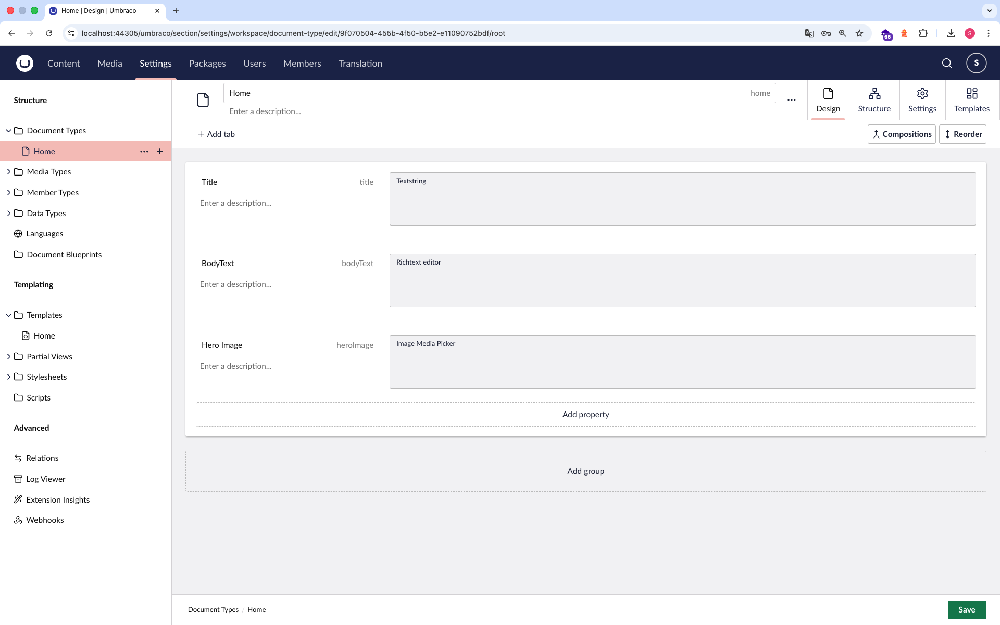
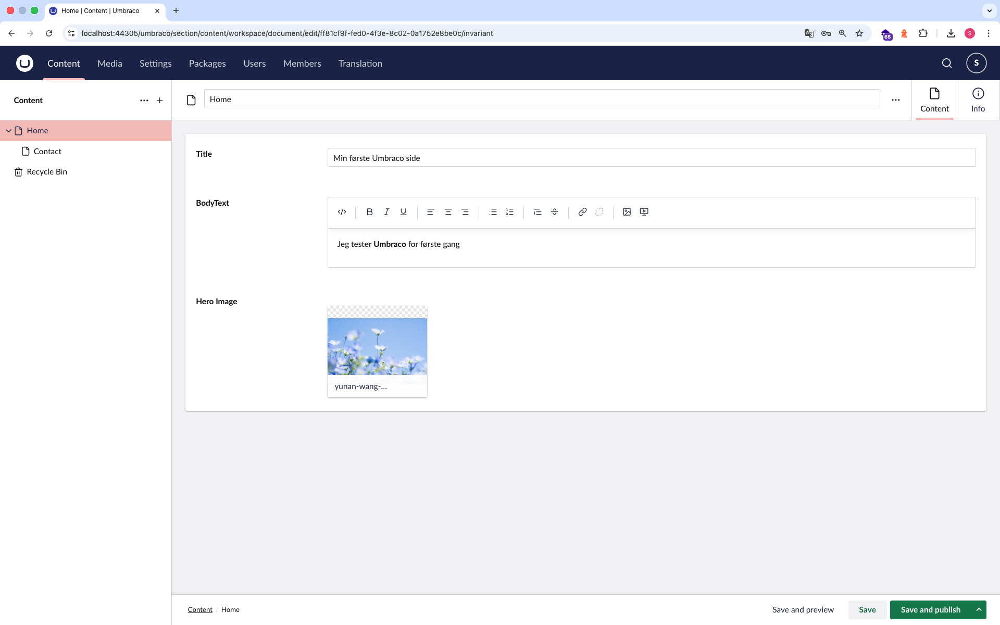
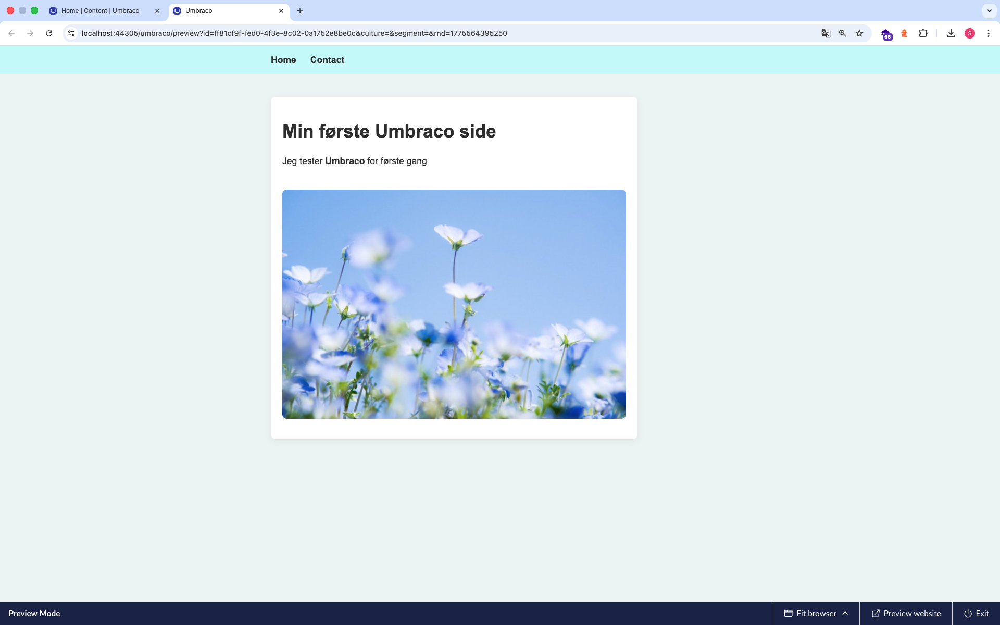

# Umbraco How-To

## Purpose

This guide describes how I explored Umbraco basics as part of the CMS assignment.

---

## 1. Creating the Umbraco project

I created a new Umbraco project using the terminal:

```bash
dotnet new -i Umbraco.Templates
mkdir cms-umbraco-project
cd cms-umbraco-project
dotnet new umbraco --name cms-umbraco-project
cd cms-umbraco-project
dotnet run
```

After running the project, Umbraco started locally and I could access the backoffice in the browser.

---

## 2. Creating a Document Type

I created a Document Type called **Home**.

It included:

- Title (Textstring)
- BodyText (Rich Text Editor)
- Hero Image (Media Picker)

This showed that Umbraco requires defining content structure before creating content.



---

## 3. Creating a Template

I created a template for the Home Document Type using Razor.

Example:

```cshtml
<h1>@Model.Value("title")</h1>

<div>
    @Model.Value("bodyText")
</div>
```

The template displays content like title, text, and image.

---

## 4. Creating Content

In the Content section, I created:

- Home page
- Contact page

I used "Save and publish" to make them visible.



---

## 5. Navigation

I created a simple navigation menu using a loop in the template.

This made it possible to navigate between the two pages.

---

## 6. Styling

I added styling using a CSS file:

wwwroot/css/style.css

The CSS file was linked in the template.

---

## 7. Image

I added an image using a Media Picker field.

The image was displayed in the template using Razor.

---

## 8. Result


